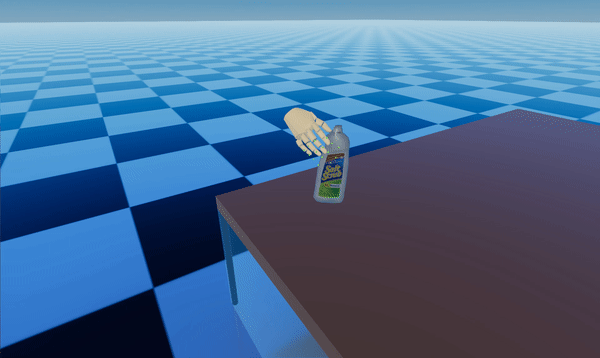

# D-Grasp: Physically Plausible Dynamic Grasp Synthesis for Hand-Object Interactions
## [Paper](https://arxiv.org/pdf/2112.03028.pdf) | [Video](https://youtu.be/5OqbDq-pgLc) | [Project Page](https://eth-ait.github.io/d-grasp/)

 


### Contents

1. [Info](#info)
2. [Installation](#installation)
3. [Demo](#demo)
4. [Training](#training)
5. [Evaluation](#evaluation)
5. [Citation](#citation)
5. [License](#license)

## Info
This code was tested with Python 3.8 on Ubuntu 18.04 and 20.04.


## Installation


For good practice for Python package management, it is recommended to use virtual environments (e.g., `virtualenv` or `conda`) to ensure packages from different projects do not interfere with each other.

For installation, we follow the official [RaiSim guide](https://raisim.com/sections/Installation.html) to install the physics simulator. See and follow our documentation of the installation steps under [docs/INSTALLATION.md](./docs/INSTALLATION.md). Note that you need to get a valid, free license and an activation key via this [link](https://docs.google.com/forms/d/e/1FAIpQLSc1FjnRj4BV9xSTgrrRH-GMDsio_Um4DmD0Yt12MLNAFKm12Q/viewform). 

## Demo

We provide some pretrained models to view the output of our method. They are stored in [this folder](./raisimGymTorch/pretrained_policies/).

- To visualize the policy for motion synthesis, run the following from the raisimGymTorch folder:
    ```Shell
    python raisimGymTorch/env/envs/dgrasp/runner_motion.py -ao -e 'all_objs'  -sd 'pretrained_policies' -w 'full_6000.pt' 
    ```
  The visualization should look like this, with randomly sampled objects and sequences:

   

   To just visualize one object, add the flag ```-o <obj_id>```.

- If you want to run the policy that was trained for a single object, run the following command from the raisimGymTorch folder:
    ```Shell
    python raisimGymTorch/env/envs/dgrasp/runner_motion.py -o 12 -e '021_bleach_dexycb' -sd 'pretrained_policies' -w 'full_3000.pt' 
    ```

- Similarly, policies can be run for the other objects. The commands for all pretrained policies are stored in [this file](./raisimGymTorch/scripts/run_pretrained_policies.sh). (The missing models will be added over the coming days).


## Training

- To train a new policy from scratch with labels from DexYCB (Chao et. al, CVPR 2021), you need to run the runner.py file from within the raisimGymTorch folder as follows:
    ```Shell
    python raisimGymTorch/env/envs/dgrasp/runner.py  -o <obj_id> -e <exp name> -d <experiment path> -sd <storage folder> 
    ```
  where ```-o``` indicates the object id according to DexYCB. ```-d``` is the path the RaiSim data should be stored and ```-sd``` indicates in which folder you want your current batch of experiments to be stored. By default, the experiments will be stored in the raisimGymTorch directory in a folder called ```data_all```.


- If you want to train a single policy over all objects, run the following:
    ```Shell
    python raisimGymTorch/env/envs/dgrasp/runner.py -ao -e <exp name> -d <experiment path> -sd <storage folder> -nr 1 -itr 6001
    ```

## Quantiative Evaluations

- Once you have a trained policy and want to evaluate it, you can run the following commands. 

   ```Shell
   python raisimGymTorch/env/envs/dgrasp_test/runner.py -o <obj_id> -e '<exp name>' -w '<policy path>.pt' -d <experiment path> -sd <storage folder>
   ```

- For example, running the following command:
   ```
   python raisimGymTorch/env/envs/dgrasp_test/runner.py -o 12 -e '021_bleach_dexycb' -sd 'pretrained_policies' -w 'full_3000.pt' 
   ```

   Should yield the following output (different hardware may lead to slight deviations for the displacement values):

   ```
   ----------------------------------------------------
   object:                                      12
   success:                                  1.000
   disp mean:                                0.282
   disp std:                                 0.092
   ----------------------------------------------------
   ```

- Note if you want the policy trained over all object to be evaluated as such, ```-o <obj_id>``` can be replaced by ```-ao```.
For example, evaluating the policy trained on all objects (compare with main paper) can be run with:

   ```
   python raisimGymTorch/env/envs/dgrasp_test/runner.py -ao -e 'all_objs'  -sd 'pretrained_policies' -w 'full_6000.pt' 
   ```

   The last rows of the terminal output should look like this (different hardware may lead to slight deviations for the displacement values):

   ```
   ----------------------------------------------------
   all objects
   total success rate:                       0.777
   disp mean:                                4.850
   disp std:                                 9.337
   ----------------------------------------------------
   ```


## Visual Evaluation 

If you want interactive visualizations, you need to open the unity executable in the [raisimUnity](./raisimUnity/linux/) folder. The videos of the sequences will be stored within the  ```raisimUnity/<OS>/Screenshot``` folder. Note that this does not work on headless servers.

### Visual Evaluation Stability Test
- This command visualizes the experiment where the surface is removed to see whether an object slips:

   ```
   python raisimGymTorch/env/envs/dgrasp_test/runner.py -o <obj_id> -e '<exp name>' -w '<policy path>.pt' -d <experiment path> -sd <storage folder> -ev
   ```

- For example, the command:
   ```
   python raisimGymTorch/env/envs/dgrasp_test/runner.py -o 12 -e '021_bleach_dexycb' -sd 'pretrained_policies' -w 'full_3000.pt' -ev
   ```

   should yield the following output:

    

### Visual Evaluation Motion Synthesis 
- This command visualizes the experiment where the object is moved to a target 6D pose:

   ```
   python raisimGymTorch/env/envs/dgrasp/runner_motion.py -o <obj_id> -e '<exp name>' -w '<policy path>.pt' -d <experiment path> -sd <storage folder>
   ```

## Data Generation (Coming Soon)

We provide the possibility to generate data with our framework and customized 6D target goal spaces.

## Citation

To cite us, please use the following:

```
@inproceedings{christen2022dgrasp,
      title={D-Grasp: Physically Plausible Dynamic Grasp Synthesis for Hand-Object Interactions},
      author={Christen , Sammy and Kocabas, Muhammed and Aksan, Emre and Hwangbo, Jemin and Song, Jie and Hilliges, Otmar},
      booktitle={Proceedings of the IEEE/CVF Conference on Computer Vision and Pattern Recognition (CVPR)},
      year={2022}
```

## License

See the following [license](LICENSE.md).


