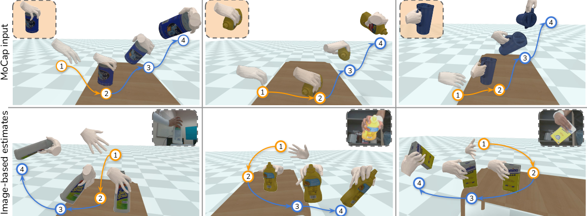

# D-Grasp: Physically Plausible Dynamic Grasp Synthesis for Hand-Object Interactions
## [Paper](https://arxiv.org/pdf/2112.03028.pdf) | [Video](https://youtu.be/5OqbDq-pgLc) | [Project Page](https://eth-ait.github.io/d-grasp/)

 

Code for the paper [D-Grasp: Physically Plausible Dynamic Grasp Synthesis for Hand-Object Interactions](https://arxiv.org/pdf/2112.03028.pdf) will be released here soon.

```
@inproceedings{christen2022dgrasp,
      title={D-Grasp: Physically Plausible Dynamic Grasp Synthesis for Hand-Object Interactions},
      author={Christen , Sammy and Kocabas, Muhammed and Aksan, Emre and Hwangbo, Jemin and Song, Jie and Hilliges, Otmar},
      booktitle={Proceedings of the IEEE/CVF Conference on Computer Vision and Pattern Recognition (CVPR)},
      year={2022}
```